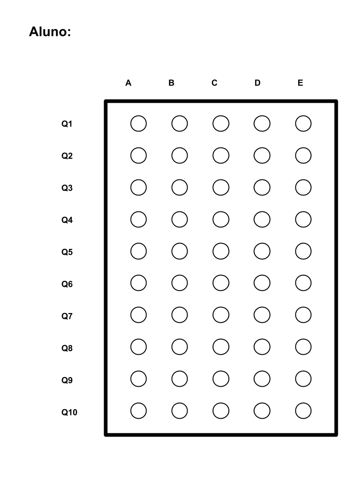

# Corretor automatizado de gabaritos através de análise de imagem

Tire uma foto do gabarito de cada estudante e obtenha a correção de maneira automática

## Requisitos

É necessário ter o python3 e o pip instalado em seu computador:

[instalação no Linux](https://python.org.br/instalacao-linux/)

[instalação no Windows](https://python.org.br/instalacao-windows/)

Instale as dependências do arquivo requirements.txt

```
pip install -r requirements.txt
```

## Configurando o script de correção

No topo do arquivo `corretor.py` será necessário cadastrar quantas questões seu gabarito possui, e quantas alternativas, por exemplo, um gabarito com 12 questões e 5 alternativas ["a", "b", "c", "d", "e"] deve ser preenchido da seguinte forma:

```
NUMERO_QUESTOES = 12
NUMERO_ALTERNATIVAS = 5
```

Também é possível cadastrar qual é o gabarito correto para que o script calcule a quantidade de acertos de cada gabarito, preenchendo o vetor `gabarito` com as respostas em sequência.

Ex: Em uma prova de 5 questões onde as 4 primeiras alternativas são letra "a" e a última letra "e" deve ser preenchido da seguinte maneira:

```
gabarito = ["a", "a", "a", "a", "e"]
```

## Premissas do gabarito

Este script foi preparado para identificar um grande retângulo delimitando a área de interesse, que são os cículos a serem preenchidos pelos estudantes, portanto, é necessário que seu gabarito possua este retângulo bem definido na folha, e os círculos das opções estejam equidistantes entre as bordas do retângulo e os outros círculos

Segue um modelo de gabarito:



## Executando o script

### Colocando as fotos dos gabaritos

- Apague os gabaritos de exemplo da pasta `gabaritos`

- Coloque nesta pasta as fotos dos gabaritos a serem corrigidos, uma dica é nomear o arquivo com o nome do estudante que marcou o gabarito, assim ao final o script relaciona a nota ao estudante

### Execute o script

Uma vez com as fotos colocadas na pasta de "gabaritos" basta executar o script com:

```
python corretor.py
```

ou

```
python3 corretor.py
```

Então o terminal corrigirá os gabaritos da pasta e informará as pontuações no seguinte formato:

```
Estudante:  Nome do Estudante Respostas:  ['A', 'B', 'C', 'D', 'E', 'A', 'B', 'C', 'D', 'E'] Nota:  10 / 10
Estudante:  estudanteQueTirou4 Respostas:  ['A', 'B', 'C', 'D', 'C', 'D', 'E', 'D', 'C', 'B'] Nota:  4 / 10
Estudante:  estudanteQueDeixouEmBranco Respostas:  ['N/A', 'N/A', 'N/A', 'N/A', 'N/A', 'N/A', 'N/A', 'N/A', 'N/A', 'N/A'] Nota:  0 / 10
Estudante:  estudanteQueTirou5 Respostas:  ['A', 'A', 'B', 'B', 'E', 'E', 'B', 'B', 'D', 'E'] Nota:  5 / 10
Estudante:  estudante5Perspectiva Respostas:  ['A', 'A', 'B', 'B', 'E', 'E', 'B', 'B', 'D', 'E'] Nota:  5 / 10
```
